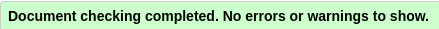
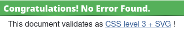

<h1 align="center">Memory Trainer</h1>

Memory Trainer is a entertaining simple to play memory card game targeted towards users of all ages. The site was designed with the purpose of be friendly easy to navigate and accesible in different devises.

<h2 align="center"></h2>

[View the live project here.](https://github.com/vega-2135/memory-trainer/deployments/github-pages)

## User Experience (UX)

-   ### User stories

    1. As a First Time Visitor, I want to easily find the website with the game.
    2. As a First Time Visitor, I want to know what is the game about.
    3. As a First Time Visitor, I want to easily navigate the website.
    4. As a First Time Visitor, I want to quickly learn how to play the game.
    5. As a First Time Visitor, I want to select the level of difficulty.
    6. As a First Time Visitor, I want to have a feedback when I find a matching pair of pictures amd when I win the game.
    7. As a First Time Visitor, I want to be able to reset the game or play a new game whenever I choose.

-   ### Design
    -   #### Colour Scheme
        -   The color Light pink was selected for the title/header of the Game because it makes a good contrast with the black color of the title font making it easy to read.
        - For the cover image the color pink was chosen.
        - When the user hovers over any button, the button change its color from grey to bisque.
    -   #### Typography
        -   The Exo 2 font is the main font used throughout the whole website, Sans Serif is used as the fallback font in case the primary chosen font can't be loaded and used in the website. Exo 2 is a popular font used for game apps.
    -   #### Imagery
        -   Card Images: A variety of flowers and fruits images where chosen for the cards of the game.
        -   Background Image:
    -   ### Icons
        - A game controler was picked for the favicon so that the user cand easily find the tab with the game.

*   ### Wireframes

    -   Welcome Page Wireframe - [View](https://github.com/vega-2135/memory-trainer/wireframes/welcome_page.png)

    -   Levels Page Wireframe - [View](https://github.com/vega-2135/memory-trainer/wireframes/level_page.png)

    -   Game Page Wireframe - [View](https://github.com/vega-2135/memory-trainer/wireframes/game_page.png)

## Features

-   ### Univerasal Features

    -  #### Home Page
       - The home page contains a welcoming message explaining how to play the game.
       - Under the welcoming message there is a Play Game button that takes the user to the level page when the user clicks on it.
    -  #### Levels Page
       - The level page shows the users a message welcoming the user to choose the level of difficulty of the game.
       - Under the choose level message, there are three buttons with the text Easy, Medium and Hard, that will take the user to the corresponding level.
    -  #### Game Page
       - Once the user click on a level button, a new page appears with cards (6 in the easy level, 8 in the medium and 12 in the hard level). All cards are cover by a pink card that once the user click on it, it will show a picture.
       - After clicking the second pink card, if the appearing picture does not match the picture in the first card, then both pictures are 'covered' again with a pink card. If the second picture match the first one, then both pictures remain uncover.
       - Once the user has found all pairs, an alert message appear containing the following message: Congratulativns! You've matched all the cards. 
       -  At all times the user can press the reshuffle card button, to reset the game, i.e. the cards of the game are reshuffled and the game start again, or press the play again button, in which case, the user is taken to the level page.

-   #### Upcoming Features

      - More levels of difficulty.
      - Users will be able to sign-in and have an account with all their scores.
      - A timer will be added to the game.

## Technologies Used

### Languages Used

- HTML
- CSS
- JavaScript

### Frameworks, Libraries and Programs used

- [GitHub:](https://github.com/)
   - GitHub is a version control platform used for collaborative development and code management.

- [Google Fonts:](https://fonts.google.com/)  
   - Google fonts were used to import and apply a variety of fonts to enhance the visual appeal of the website.

- [Chrome DevTools:](https://developer.chrome.com/docs/devtools/)  
   - Chrome developer Tools were used for debugging, and optimizing the website during development.

- [Icons:](https://icons8.com/icons/set/favicon-game) 
   - Icons is a tool used to find all kind of icons, in this project was used for the controler icon of the website.

- [Font Awesome:](https://fontawesome.com/)
   - Font Awsome is a Icon toolkit used for the arrow icon of the Reshuffle Cards button.

- [VSCode (Visual Studio Code):](https://code.visualstudio.com/) 
   - VSCode is a lightweight and powerful code editor used for writing, editing, and debugging the code for this game.

- [Techsini:](https://techsini.com/multi-mockup/)
   - Techsii was used to create mockup images of home page in different devices (phone, ipad, laptop, desktop).

- [Pexels:](https://www.pexels.com/)
   - Pexels is an online platform for high-quality stock photos, used for the cards pictures of the game.

- [Balsamiq:](https://balsamiq.com/)
   - Balsamiq was used to generate wireframes of the game page.

## Testing

### Code validation
The W3C Markup Validator, W3C CSS Validator and JSHint JavaScript Validator Services were used to validate HTML and CSS and JavaScript code of the project to ensure there were no syntax errors in this project.

- HTML

   
- CSS

   
- JavaScript

   


## Deployment
### Deployment

#### 1. GitHub Pages Hosting:

Memory Trainer was developed using the VSCode, committed to git and pushed to GitHub.

To deploy Memory Trainer to GitHub Pages from its GitHub repository, the following steps were taken:

1. Log-in in github.
2. Open repositories page.
3. Go to Memory Trainer repository.
4. On the top menu select settings.
5. In settings, on the left side menu, select Pages.
6. In the Build and Development: 
     - In Source, select deploy from a branch.
     - In Branch, select main and then click save.
7. After a couple of minutes at the top of the page a link with the deployed page will appear.

#### 2. Clone Repository:
   - Open a terminal or command prompt on your local machine.
   - Use the following command to clone the repository to your local environment:
     ```bash
     git clone https://github.com/vega-2135/memory-trainer
     ```

3. ### Navigate to the Project:
   - Change into the project directory:
     ```bash
     cd https://github.com/vega-2135/memory-trainer
     ```

4. ### View Locally:
   - Open the `index.html` file in your preferred web browser to preview the website locally.


#### GitHub Pages Configuration:

GitHub Pages automatically publishes your site when you push changes to the `gh-pages` branch or the `docs` folder in the `main` branch. Ensure your repository is configured accordingly for GitHub Pages.

For more details on GitHub Pages, refer to the [GitHub Pages Documentation](https://docs.github.com/en/pages).


* Background image: [Rika from flicker](https://www.flickr.com/photos/rikaconfesses/8319972287/in/photolist-dFd2U4-64kfrg-64keaD-dTb7Km-2dCRMx-xQC7Bu-65nZvD-Qxv5PY-khzYCk-23k3hpu-4MfYe8-nYsJyX-2bdbAH1-QgG3DC-VcnuyH-T3zH6J-65sh3Q-dFiu5u-WW78rt-dcQLhe-9vo2u8-uC569-fzYLdi-UJizVD-2zf8Sm-4zs34-6uP4cg-6Gw1E-G9Kvx1-Fiejzo-wsVrgz-26t9pTQ-2t8bb-6gNLKE-24EWPv7-UJiACv-q95i6N-p7ru5a-C9sjKk-28CvXKt-9f3mg7-SRucUb-y2HiCC-qB2SZb-22DsK29-oreNv-29QAn9S-U9bXyS-8VSbhU-JwFGTP)
